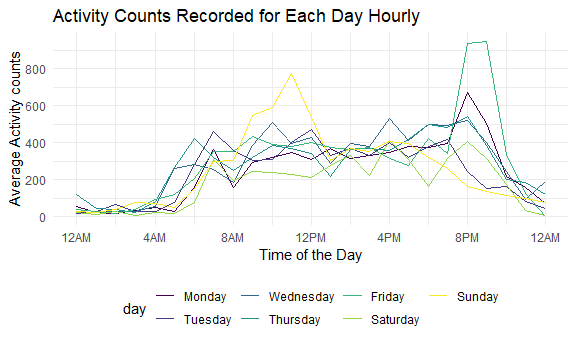

P8105 HW3
================
Yihan Feng
10/6/2020

# Problem 1

``` r
data("instacart")
```

This dataset contains 1384617 rows and … columns.

Observations are the level of items in orders by user. There are user /
order variables – user ID, order ID, order day, and order hour. There
are also item variables – name, aisle, department, and some numeric
codes.

How many aisles, and which are most items from?

``` r
instacart %>% 
    count(aisle) %>% 
    arrange(desc(n))
```

    ## # A tibble: 134 x 2
    ##    aisle                              n
    ##    <chr>                          <int>
    ##  1 fresh vegetables              150609
    ##  2 fresh fruits                  150473
    ##  3 packaged vegetables fruits     78493
    ##  4 yogurt                         55240
    ##  5 packaged cheese                41699
    ##  6 water seltzer sparkling water  36617
    ##  7 milk                           32644
    ##  8 chips pretzels                 31269
    ##  9 soy lactosefree                26240
    ## 10 bread                          23635
    ## # ... with 124 more rows

## Make a plot.

``` r
instacart %>% 
    count(aisle) %>% 
    filter(n > 10000) %>% 
    mutate(
        aisle = factor(aisle),
        aisle = fct_reorder(aisle, n)
    ) %>% 
    ggplot(aes(x = aisle, y = n)) + 
    geom_point() + 
    theme(axis.text.x = element_text(angle = 90, vjust = 0.5, hjust = 1))
```


## Make a table.

``` r
instacart %>% 
    filter(aisle %in% c("baking ingredients", "dog food care", "packaged vegetables fruits")) %>% 
    group_by(aisle) %>% 
    count(product_name) %>% 
    mutate(rank = min_rank(desc(n))) %>% 
    filter(rank < 4) %>% 
    arrange(aisle, rank) %>% 
    knitr::kable()
```

| aisle                      | product\_name                                 |    n | rank |
| :------------------------- | :-------------------------------------------- | ---: | ---: |
| baking ingredients         | Light Brown Sugar                             |  499 |    1 |
| baking ingredients         | Pure Baking Soda                              |  387 |    2 |
| baking ingredients         | Cane Sugar                                    |  336 |    3 |
| dog food care              | Snack Sticks Chicken & Rice Recipe Dog Treats |   30 |    1 |
| dog food care              | Organix Chicken & Brown Rice Recipe           |   28 |    2 |
| dog food care              | Small Dog Biscuits                            |   26 |    3 |
| packaged vegetables fruits | Organic Baby Spinach                          | 9784 |    1 |
| packaged vegetables fruits | Organic Raspberries                           | 5546 |    2 |
| packaged vegetables fruits | Organic Blueberries                           | 4966 |    3 |

## Apple vs. Ice cream.

``` r
instacart %>% 
    filter(product_name %in% c("Pink Lady Apples", "Coffee Ice Cream")) %>% 
    group_by(product_name, order_dow) %>% 
    summarize(mean_hour = mean(order_hour_of_day)) %>% 
    pivot_wider(
        names_from = order_dow,
        values_from = mean_hour
    )
```

    ## `summarise()` regrouping output by 'product_name' (override with `.groups` argument)

    ## # A tibble: 2 x 8
    ## # Groups:   product_name [2]
    ##   product_name       `0`   `1`   `2`   `3`   `4`   `5`   `6`
    ##   <chr>            <dbl> <dbl> <dbl> <dbl> <dbl> <dbl> <dbl>
    ## 1 Coffee Ice Cream  13.8  14.3  15.4  15.3  15.2  12.3  13.8
    ## 2 Pink Lady Apples  13.4  11.4  11.7  14.2  11.6  12.8  11.9

# Problem 2

## Load and tidy the accelerometer data.

``` r
accel_df <- read_csv("./dataset/accel_data.csv") %>%
  janitor::clean_names() %>%
  mutate(weekday_weekend = case_when(
    day %in% c("Monday", "Tuesday", "Wednesday",  "Thursday", "Friday") ~ "Weekday",
    day %in% c("Saturday", "Sunday") ~ "Weekend"), 
    day = factor(day, levels = c("Monday", "Tuesday", "Wednesday", "Thursday", "Friday", "Saturday", "Sunday"))) %>%
  pivot_longer(
    activity_1 : activity_1440,
    names_to = "activity_time",
    names_prefix = "activity_",
    values_to = "activity_counts" 
  ) %>%
  mutate(activity_time = as.numeric(activity_time))
```

The accelerometer dataset describes the activity counts for each minute
of a 24-hour day starting at midnight of a 63 year-old male with BMI 25.
The dataset has 6 variables, which are the week, day id, day, weekday or
weekend, activity time, and activity counts. It includes 50400 minutes
that collected by the accelerometer.

## Create total activity variable for each day, and then a table showing these totals.

``` r
accel_day <- accel_df %>%
  group_by(week, day) %>%
  summarize(day_activity = sum(activity_counts)) %>%
  knitr::kable(digits = 1)
```

    ## `summarise()` regrouping output by 'week' (override with `.groups` argument)

``` r
accel_day
```

| week | day       | day\_activity |
| ---: | :-------- | ------------: |
|    1 | Monday    |       78828.1 |
|    1 | Tuesday   |      307094.2 |
|    1 | Wednesday |      340115.0 |
|    1 | Thursday  |      355923.6 |
|    1 | Friday    |      480542.6 |
|    1 | Saturday  |      376254.0 |
|    1 | Sunday    |      631105.0 |
|    2 | Monday    |      295431.0 |
|    2 | Tuesday   |      423245.0 |
|    2 | Wednesday |      440962.0 |
|    2 | Thursday  |      474048.0 |
|    2 | Friday    |      568839.0 |
|    2 | Saturday  |      607175.0 |
|    2 | Sunday    |      422018.0 |
|    3 | Monday    |      685910.0 |
|    3 | Tuesday   |      381507.0 |
|    3 | Wednesday |      468869.0 |
|    3 | Thursday  |      371230.0 |
|    3 | Friday    |      467420.0 |
|    3 | Saturday  |      382928.0 |
|    3 | Sunday    |      467052.0 |
|    4 | Monday    |      409450.0 |
|    4 | Tuesday   |      319568.0 |
|    4 | Wednesday |      434460.0 |
|    4 | Thursday  |      340291.0 |
|    4 | Friday    |      154049.0 |
|    4 | Saturday  |        1440.0 |
|    4 | Sunday    |      260617.0 |
|    5 | Monday    |      389080.0 |
|    5 | Tuesday   |      367824.0 |
|    5 | Wednesday |      445366.0 |
|    5 | Thursday  |      549658.0 |
|    5 | Friday    |      620860.0 |
|    5 | Saturday  |        1440.0 |
|    5 | Sunday    |      138421.0 |

The counts tend to be low at the beginning of each week, and then
increase to the peak on Friday, and decrease at the weekend.

## Accelerometer data allows the inspection activity over the course of the day. Make a single-panel plot that shows the 24-hour activity time courses for each day and use color to indicate day of the week.

### Make a single-panel plot to show 24-hour activity time courses for each day.

``` r
accel_hour <- accel_df %>%
mutate(hour_time = activity_time %/% 60) %>%
group_by(day, hour_time) %>%
summarize(hour_counts = mean(activity_counts)) %>%
  ggplot(aes(x = hour_time, y = hour_counts, color = day)) +
  geom_line() +
  scale_x_continuous(breaks = c(0, 4, 8, 12, 16, 20, 24), 
                     labels = c("12AM", "4AM", "8AM", "12PM", "4PM", "8PM", "12AM")) + 
  scale_y_continuous(breaks = c(0, 200, 400, 600, 800, 1000), 
                     labels = c("0", "200", "400", "600", "800", "1000")) +
  labs(
    x = "Time of the Day", 
    y = "Average Activity counts",
    title = "Activity Counts Recorded for Each Day Hourly"
  ) + 
viridis::scale_color_viridis(discrete = TRUE)
```

    ## `summarise()` regrouping output by 'day' (override with `.groups` argument)

``` r
accel_hour
```



According to the graph, the participant has a low and steady activity
count, lower than 100, from the midnight to 4AM in the morning. In the
next two hours, from 4AM to 6AM, the activity counts increases to about
400, and keeps steady until 6PM. During 6PM and 8PM, the activity counts
reach to the peak of the day, and decreases gradually to 100 counts.

# Problem 3

``` r
library(p8105.datasets)
data("ny_noaa")
```

## To that end, write a short description of the dataset, noting the size and structure of the data, describing some key variables, and indicating the extent to which missing data is an issue

## Do some data cleaning. Create separate variables for year, month, and day. Ensure observations for temperature, precipitation, and snowfall are given in reasonable units. For snowfall, what are the most commonly observed values? Why?

## Make a two-panel plot showing the average max temperature in January and in July in each station across years. Is there any observable / interpretable structure? Any outliers?

## Make a two-panel plot showing (i) tmax vs tmin for the full dataset (note that a scatterplot may not be the best option); and (ii) make a plot showing the distribution of snowfall values greater than 0 and less than 100 separately by year.
